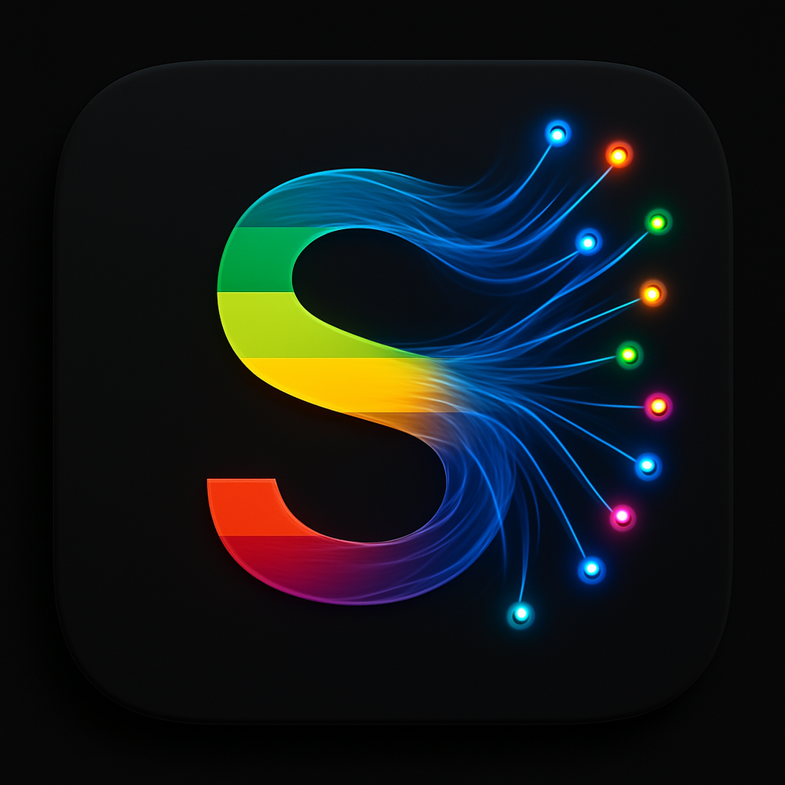

# GerdsenAI Socrates

## WIP...



## Features

### **🤖 AI-Powered Chat & Analysis**
- **Advanced Chat Interface**: Real-time conversation with local and network Ollama models
- **AI Code Analysis**: Intelligent error detection, suggestions, and fixes via LSP integration
- **Smart Completions**: Context-aware code completions with AI-powered suggestions
- **Intelligent Hover**: AI explanations for code elements and functions

### **🔍 Web Search & Knowledge**
- **SearXNG Integration**: Built-in web search with health monitoring and Docker setup
- **Real-time Search**: Toggle-able internet search with GitHub, Stack Overflow, and more
- **Search Health Indicators**: Visual status monitoring with automatic failover

### **📚 Document Intelligence (RAG)**
- **Document Management**: Upload, organize, and search through technical documents
- **RAG System**: Retrieval-Augmented Generation for context-aware responses
- **Collection Management**: Create and manage document collections with metadata
- **Semantic Search**: Intelligent document search with relevance scoring

### **💻 Development Tools**
- **LSP Server Integration**: Language Server Protocol with AI-enhanced diagnostics
- **Model Selection**: Dynamic switching between local and network Ollama models
- **Performance Optimized**: Debounced analysis, response caching, background processing
- **Multi-language Support**: JavaScript, TypeScript, Rust, Python, and more

### **🎨 User Experience**
- **Professional UI**: Modern dark theme with smooth animations and real-time feedback
- **Health Monitoring**: Real-time status indicators for all services
- **Light & Dark Mode**: Seamless theme switching to match your IDE
- **Responsive Design**: Optimized for various screen sizes and usage patterns

## System Requirements

- Windows 11 (recommended) or Windows 10
- 8GB RAM minimum (16GB recommended)
- 2GB free disk space
- Processor with 4+ cores
- Microsoft WebView2 Runtime
- Visual Studio Build Tools 2022
- Ollama installed (https://ollama.ai/download)

## Quick Start

1. **Install Dependencies**:
   - Right-click on `INSTALL_DEPENDENCIES.BAT` and select "Run as administrator"
   - Follow the on-screen instructions

2. **Start the Application**:
   - Run `START_APPLICATION.BAT`
   - The application will automatically connect to Ollama

3. **Using the Application**:
   - Select a model from the dropdown menu
   - Use the chat interface to ask questions or request code assistance
   - Toggle between Chat, Search, RAG, and History views using the tabs
   - Use the bottom toolbar for additional actions

For detailed setup instructions, see [WINDOWS_SETUP.md](./WINDOWS_SETUP.md).

## Development Philosophy

This project follows an **Inquiry-Based Learning** approach to development:

- **Question First**: Understand the 'why' before the 'how'
- **Challenge Assumptions**: Verify what we think we know
- **Explore Alternatives**: Consider multiple solutions
- **Learn Continuously**: Every bug is a learning opportunity

See [CONTRIBUTING.md](./CONTRIBUTING.md) for detailed guidelines.

## Development

### Prerequisites

- Node.js 20.x or later
- Rust and Cargo
- Visual Studio Build Tools 2022
- Tauri CLI

### Development Commands

```bash
# Install dependencies
npm install

# Start development server
npm run tauri dev

# Build for production
npm run tauri build

# Run tests
npm test

# Run tests with coverage
npm run test:coverage

# Generate installer
./GENERATE_INSTALLER.BAT
```

## Testing

GerdsenAI Socrates includes comprehensive production-ready testing infrastructure:

### Frontend Tests
- **24/24 tests passing** for ChatInterface component (100% coverage)
- Full Tauri command mocking and deterministic results
- Complete user workflow testing including streaming responses and error handling

### Backend Tests  
- **70+ comprehensive Rust tests** across critical modules
- HTTP mocking with mockito for external API calls
- Concurrency, performance, and edge case testing
- Memory bounds and resource constraint validation

Run the test suite:
```bash
# Frontend tests
npm test

# Backend tests (requires Rust/Cargo)
cd src-tauri && cargo test
```

## License

Copyright © 2025 GerdsenAI. All rights reserved.
